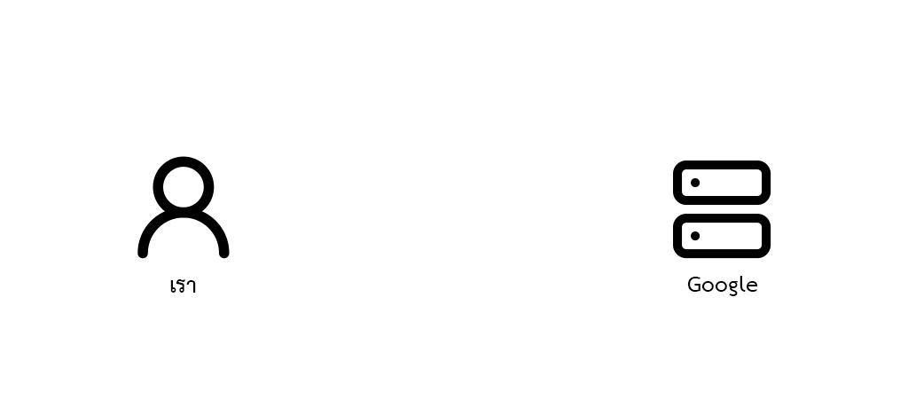

# Traditional Website

ก่อนจะเข้าใจว่าเว็บในสมัยนี้ทำไมถึงเป็นอย่างนั้นหรือแบบนี้ ต้องเข้าใจการทำงานในอดีตกันก่อน

โดยเมื่อก่อนนั้นการที่เราเข้าซักเว็บไซต์นึงเช่น [Google](https://google.com) คอมพิวเตอร์เราจะขอหน้าเว็บไซต์จาก Server ของเว็บนั้นๆ

:::note
Server ก็แค่คอมพิวเตอร์เครื่องหนึ่ง แต่ได้มีการตั้งค่าหรือติดตั้งบางอย่างทำให้ Server ไม่เหมือนกับคอมพิวเตอร์ทั่วๆไป
:::

หลังจากขอข้อมูลไป Server จะข้อความประเภทนึงมาให้เรา เป็นรูปแบบข้อความเรียกว่า [HTML (Hypertext Markup Language)](https://en.wikipedia.org/wiki/HTML)
และบราวเซอร์ของเรา (เช่น Google Chrome, Safari) จะมีหน้าที่นำข้อความนั้นมาจัดรูปแบบ กลายเป็นเว็บไซต์ที่เราเห็นกัน

HTML เป็นข้อความกำหนดว่าจะให้หน้าตาเว็บเราออกมาเป็นยังไง

ข้อความรูปแบบ HTML

```html
<!DOCTYPE html>
<html>
  <head>
    <title>This is a title</title>
  </head>
  <body>
    <div>
        <p>Hello world!</p>
    </div>
  </body>
</html>
```



:::warning[Important]
สิ่งที่ Server ส่งมาไม่ใช่ **"ไฟล์"** แต่เป็น **"ข้อความ"** ซึ่งไม่เหมือนกัน
ใน Animation นี้แค่ให้รู้ว่าเป็นข้อความนั้นอยู่ในรูปแบบของ HTML
:::

ในยุคต่อมาก็ได้มีการเพิ่มไฟล์ที่ส่งเข้ามาเพื่อทำให้เว็บไซต์มีสีสันและสามารถทำอะไรได้หลายๆอย่างโดยไฟล์ที่เพิ่มมานั้นเรียกว่า
Cascading Style Sheet หรือเรียกสั้นๆว่า CSS (นามสกุล `.css`) และ ไฟล์ Javascript (นามสกุล `.js`) เพื่อเพิ่ม
ความสามารถของตัวเว็บเข้าไปอีก

สรุปง่ายๆก็คือ ถ้าเราอยากเข้า Google เราก็จะต้องไปขอ Google แล้ว Google ก็จะให้ข้อความ HTML มา
บราวเซอร์ของเราก็เอาไฟล์นั้นมาจัดวางให้สวยๆ เพื่อให้เราดู

โดยปกติแล้วการขอดูแต่ละหน้าก็จะเท่ากับ 1 HTML ดังนั้นการที่เราเปิดในแต่ละหน้า
ก็จะเท่ากับการขอ Google ไปตามจำนวนหน้าที่ขอ เปิดไป 4 หน้าเว็บ ก็เท่ากับ Google ส่งไฟล์มาให้เรา 4 ครั้ง
ซึ่งถ้าเครื่อง Server ของ Google เกิดคนขอเยอะๆในเวลาเดียวกัน อาจจะทำให้ Server ทำงานหนัก ไม่ตอบสนองและอาจทำให้ไม่ส่งอะไรมาเลย
หรือที่เราเรียกกันว่า เว็บล่ม