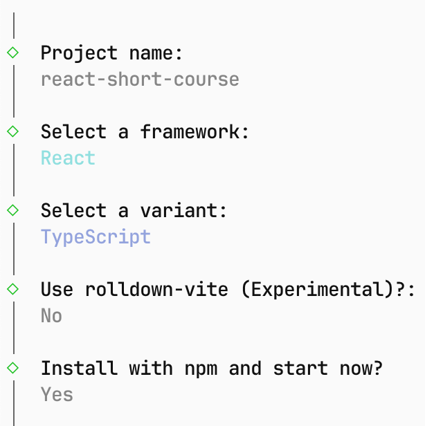
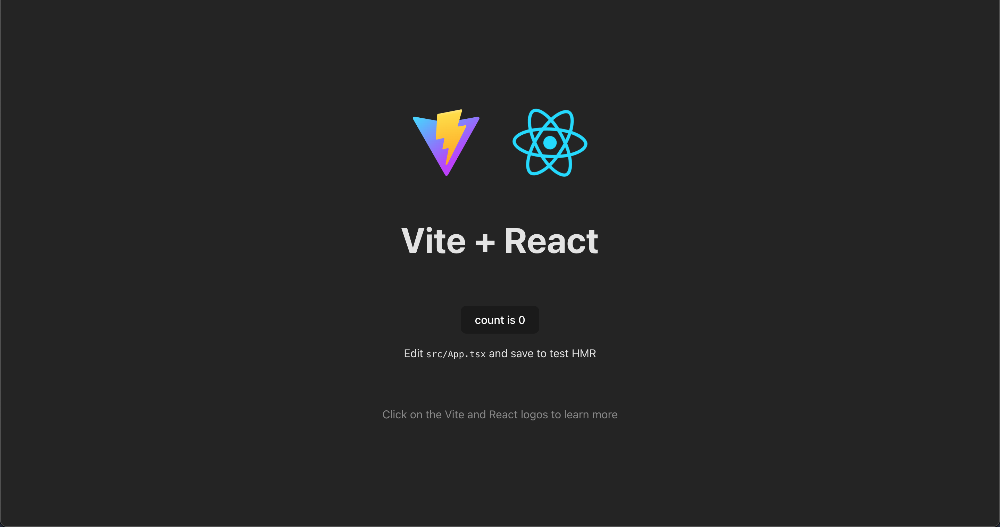

import Tabs from '@theme/Tabs';
import TabItem from '@theme/TabItem';

# Getting Started

ในส่วนของหน้านี้จะสอนการติดตั้งสิ่งที่ต้องใช้ในการสร้างโปรเจ็ค React

## ติดตั้ง Node.js

:::note
ถ้าหากมี Node.js และ npm แล้วสามารถข้ามขั้นตอนนี้ไปได้เลย
:::

หากยังไม่ติดตั้งสามารถติดตั้งได้ในหน้าเว็บ https://nodejs.org/en/download

หรือเข้า Terminal แล้วพิมพ์ตามด้านล่างนี้

<Tabs groupId="os">
  <TabItem value="Windows">
    ```bash
    powershell -c "irm https://community.chocolatey.org/install.ps1|iex"
    choco install nodejs --version="22.20.0"
    ```
  </TabItem>
  <TabItem value="macOS">
    ```bash
    curl -o- https://raw.githubusercontent.com/Homebrew/install/HEAD/install.sh | bash
    brew install node@22    
    ```
  </TabItem>
  <TabItem value="Linux">
    ```bash
    sudo apt install node
    sudo apt install npm
    ```
  </TabItem>
</Tabs>

จากนั้นเช็คว่าติดตั้งรึยัง

```bash
node -v
npm -v
```

หากมีเลขเวอร์ชั่นขั้นและไม่มี Error ใดๆแสดงว่าติดตั้งเสร็จแล้ว

---

## ติดตั้ง React ด้วย Vite


```bash
npm create vite@latest -y
```

และเลือกตัวเลือกดังนี้



เข้าไปยัง http://localhost:5173 หากมีหน้าเว็บขึ้นดังรูปด้านล่างแสดงว่าติดตั้งสำเร็จแล้ว

