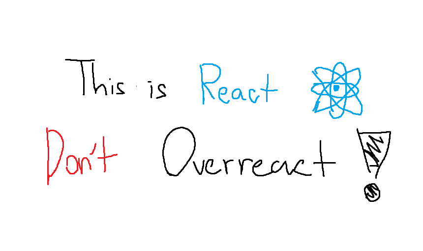

# Welcome to Basic React Course

คอร์ส React เบื้องต้นสำหรับทุกคนที่อยากหัดเขียนเว็บ

สวัสดีครับทุกคน เว็บไซต์นี้ทำขึ้นด้วยความตั้งใจของผมนาย นนทกร ศรีชัย นักศึกษาชั้นปีที่ 3 (ณ​ วันที่สอนอะนะ) จาก [CSDev](https://dev.cskmitl.com) ภาควิชาวิทยาการคอมพิวเตอร์ สถาบันเทคโนโลยีพระจอมเกล้าเจ้าคุณทหารลาดกระบัง เพื่อให้ทุกคนได้เรียนการเขียนเว็บไซต์ React จากความรู้ที่ผมพอจะมีครับ ;D

***ขอให้สนุกครับ ^^***

:::note
เว็บไซต์นี้เป็นเว็บที่ใช้ในการสอนพื้นฐาน React ใน Short Course ของภาควิชาในวันที่ 5 ตุลาคม พ.ศ. 2568
เนื้อหาอาจจะไม่ครบถ้วนและหากมีข้อมูลที่ผิดพลาด สามารถ Issue ได้ทาง [Github](https://github.com/66050207-Nonthakorn/react-short-course) ของเว็บไซต์นี้และขออภัยเป็นอย่างสูง
:::